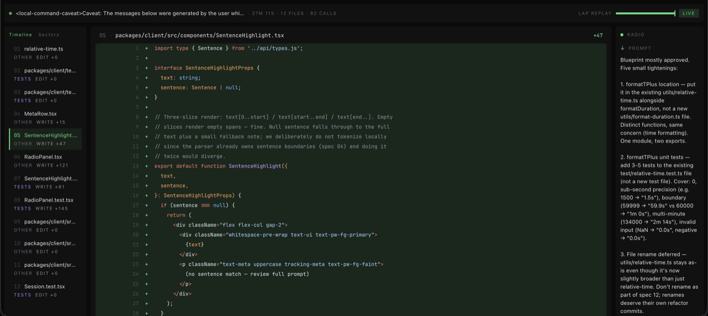
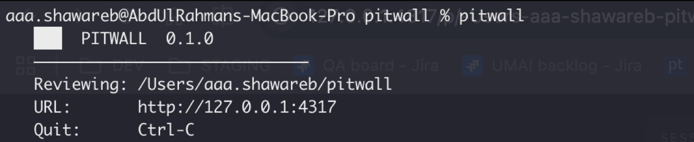
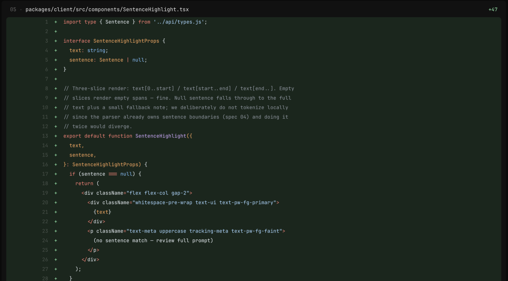
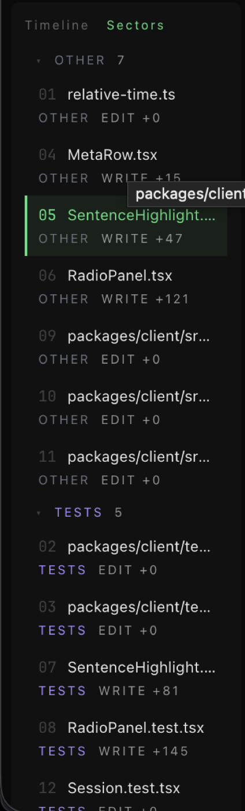

<p align="center">
  <picture>
    <source media="(prefers-color-scheme: dark)" srcset="brand/svg/pitwall-logo-dark.svg">
    <source media="(prefers-color-scheme: light)" srcset="brand/svg/pitwall-logo-light.svg">
    
  </picture>
</p>

<p align="center">
  <strong>The pitwall view of AI engineering</strong> — radio, sectors, lap replay, dark mode, local-first, zero configuration.
</p>

<p align="center">
  <a href="https://www.npmjs.com/package/pitwall"></a>
  <a href="./LICENSE"></a>
  
</p>

---

## Why Pitwall

Claude Code can dump 500 lines across 12 files in a single session. Reviewing
that in a standard `git diff` is noisy: files are alphabetical, intent is
invisible, and the reasoning behind each edit is lost. Pitwall reads the
session log Claude Code already writes to `~/.claude/projects/` and renders
it in an interface built for human oversight of AI-generated code —
chronological by default, with the triggering prompt and Claude's thinking
surfaced next to every edit.

## Install

Global:

```bash
npm i -g pitwall
```

Or one-shot via npx:

```bash
npx pitwall
```

Requires Node 20 or newer.

## Usage

From the project directory you ran Claude Code in:

```bash
pitwall
```

This opens your browser at the picker for the current project's sessions.

Show every project you've ever run Claude Code against:

```bash
pitwall --all
```

Deep-link into a specific session:

```bash
pitwall --session 01d0c2e4-aaaa-bbbb-cccc-123456789abc
```

Other flags:

| Flag | Purpose |
| --- | --- |
| `--port <n>` | Pin the server to a specific port |
| `--no-open` | Start the server without launching a browser |
| `--help`, `-h` | Print usage |
| `--version`, `-v` | Print version |

Quit with `Ctrl-C`.

## Screenshots









## How it works

Pitwall has three pillars:

- **Radio — intent mapping.** Every edit is linked to the sentence in your
  prompt that triggered it, and to Claude's thinking block that preceded it.
- **Timeline — chronological review.** Files appear in the exact order
  Claude edited them. Step through the session as the AI experienced it,
  not as an alphabetical tree.
- **Lap Replay — session scrubbing.** Drag the timeline scrubber to
  reconstruct the codebase at any point during the session.

See [`docs/00-overview.md`](docs/00-overview.md) for the full design.

## Privacy

Pitwall is 100% local:

- It reads session logs from `~/.claude/projects/` that Claude Code already
  wrote to your disk.
- It makes **no network calls**. No telemetry, no analytics, no update
  checks, no cloud sync.
- It runs a web server bound to `127.0.0.1`. Nothing is exposed to other
  machines on your network.
- Installing it runs no `postinstall` scripts beyond standard dependency
  compilation.

## Contributing

Pitwall is built from 15 atomic specs (`specs/01-*.md` through
`specs/15-*.md`). Each spec is implemented in a separate Claude Code
session following a strict A→F cycle defined in [`CLAUDE.md`](CLAUDE.md).

If you want to contribute:

1. Read `CLAUDE.md` — the project rules are non-negotiable.
2. Read `docs/00-overview.md` through `docs/04-ui-system.md` for the
   foundational design.
3. Open an issue before large changes; scope belongs in a spec, not a PR.

## License

MIT — see [`LICENSE`](LICENSE).
